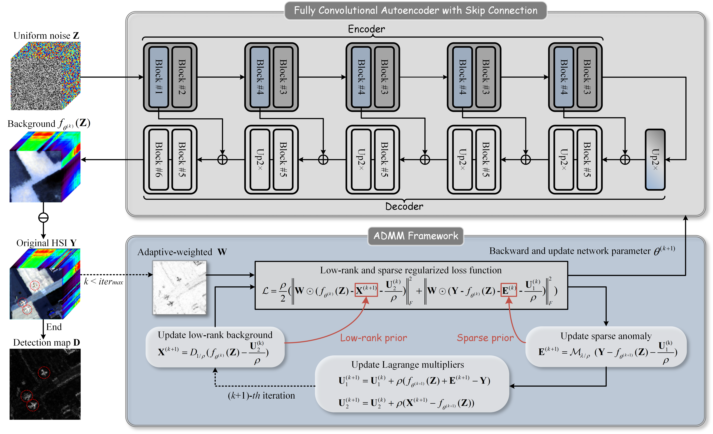
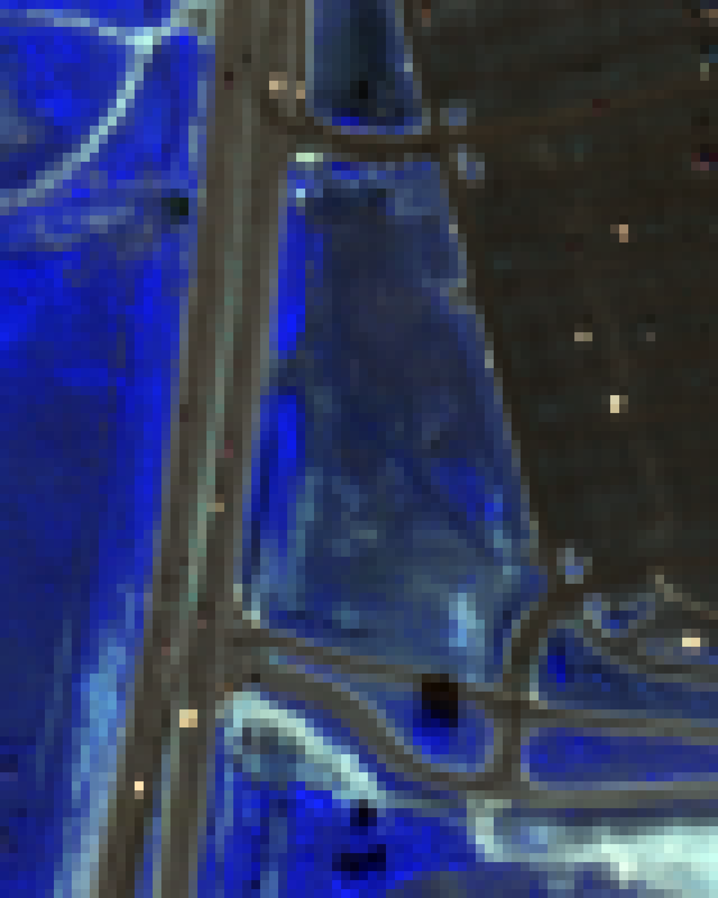
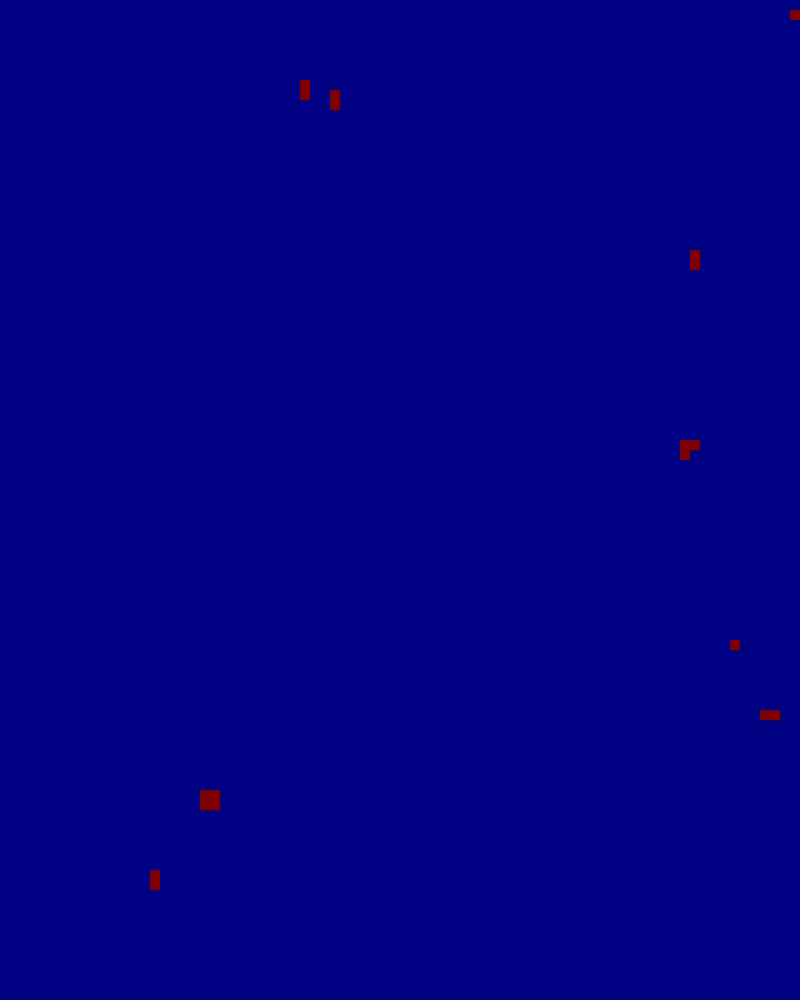
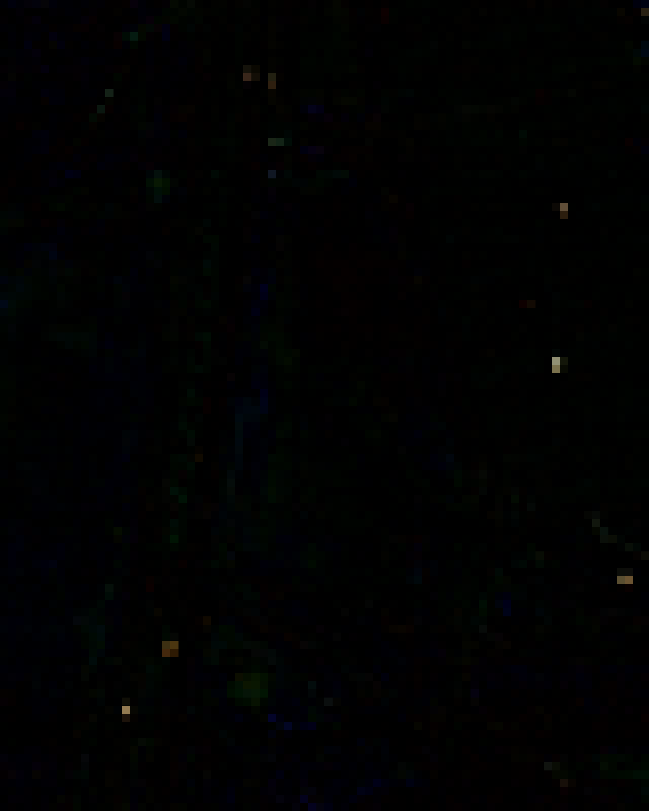
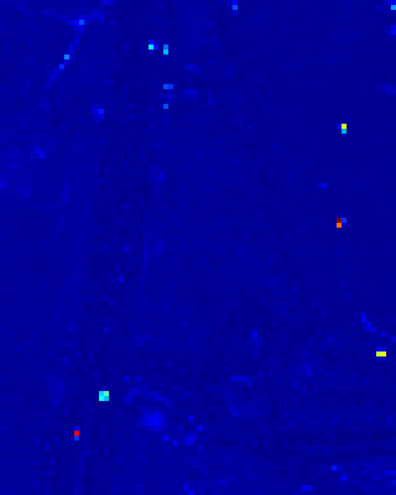

# JLSAE: Joint Low-Rank and Sparse Autoencoder for Hyperspectral Anomaly Detection

Official implementation of **JLSAE: Joint Low-Rank and Sparse Autoencoder for Hyperspectral Anomaly Detection**.

JLSAE jointly models the low-rank structure of the background and the sparse characteristics of anomalies within a unified autoencoder framework.

This repository provides a simple implementation for reproducing and comparing hyperspectral anomaly detection methods.

## Framework

<p align="center">
  <br>
  <em>Overall framework of JLSAE.</em>
</p>

## Requirements

A standard PyTorch environment is sufficient to run the code.

The main required packages include:

```text
Python
PyTorch
NumPy
SciPy
Matplotlib
```

A CUDA-enabled PyTorch environment is recommended for GPU acceleration.

## Data Preparation

Place the test hyperspectral data in the `data` folder.

Each data file should be stored in MATLAB `.mat` format and contain the following variables:

- `data`: hyperspectral image data
- `map`: ground-truth anomaly map

An example directory structure is:

```text
JLSAE/
├── data/
│   └── example.mat
├── models/
├── utils/
├── result/
└── train.py
```

The main folders are organized as follows:

- `data/`: stores the hyperspectral data sets used for testing.
- `result/`: stores the generated detection maps, AUC values, or other output results.
- `models/`: contains the network architecture of JLSAE.
- `utils/`: contains commonly used utility functions, such as data loading, ROC calculation, AUC calculation, and result visualization.
- `figures/`: contains the images used in this README, including the framework and detection-result figures.

Before running the code, modify the data file name in `train.py`:

```python
path = 'data/'
file_name = 'example.mat'
```

## Running the Code

Run the following command:

```bash
python train.py
```

## Results

The detection results are automatically saved in the `result` folder.

The saved `.mat` file contains:

- `detection`: anomaly detection map
- `auc`: area under the ROC curve

For example:

```text
result/example_result.mat
```

## Parameter Settings

The following parameters can be adjusted in `train.py`:

### Number of Iterations

```python
num_iter = 150
```

`num_iter` controls the number of optimization iterations. The default value for a new data set is `150`. It can be adjusted according to the convergence behavior and detection performance.

Recommended candidate values include:

```python
[100, 150, 200, 250, 300]
```

### Penalty Parameter

```python
pho = 1
```

`pho` is the penalty parameter used in the optimization process. If the detection result is unsatisfactory, it can be tuned using values such as:

```python
[1, 1.25, 1.5, 1.75]
```

### Trade-Off Parameter

```python
lam = 0.5
```

`lam` is the trade-off parameter associated with the sparse anomaly component. It can be adjusted for different data sets to obtain better detection performance.

## Reproducibility

The network parameters and the input noise tensor `Z` are randomly initialized for each run. Therefore, the detection results and AUC values may vary slightly across different runs.


## Detection Results

<table>
  <tr>
    <td align="center" valign="top" width="20%">
      <br>
      <b>Original HSI</b>
    </td>
    <td align="center" valign="top" width="20%">
      <br>
      <b>Ground Truth</b>
    </td>
    <td align="center" valign="top" width="20%">
      <br>
      <b>Reconstructed<br>Background</b>
    </td>
    <td align="center" valign="top" width="20%">
      <br>
      <b>Anomaly<br>Component E</b>
    </td>
    <td align="center" valign="top" width="20%">
      <br>
      <b>Detection Map</b>
    </td>
  </tr>
</table>

## Additional Information

Please contact `fanjiahui24@mails.ucas.ac.cn` if you have any questions about the code or its implementation.
If you find this code helpful, please cite:
```text
@ARTICLE{fan2026jlsae,
  author={Fan, Jiahui and Sun, Xiaotong and Wang, Degang and Sun, Xu and Gao, Lianru},
  journal={IEEE Transactions on Geoscience and Remote Sensing}, 
  title={JLSAE: Joint Low-Rank and Sparse Autoencoder for Hyperspectral Anomaly Detection}, 
  year={2026},
  volume={64},
  number={},
  pages={5522017-5522017},
  keywords={Ranking (statistics);Modeling;Anomaly detection;Optimization;Signal detection;Pixel;Probability;Educational institutions;Personal digital devices;Hyperspectral imaging;Autoencoder (AE);background reconstruction;hyperspectral anomaly detection (HAD);low-rank prior;model-driven deep learning;sparse prior},
  doi={10.1109/TGRS.2026.3716370}}
```

